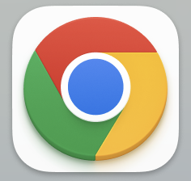
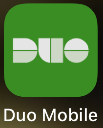
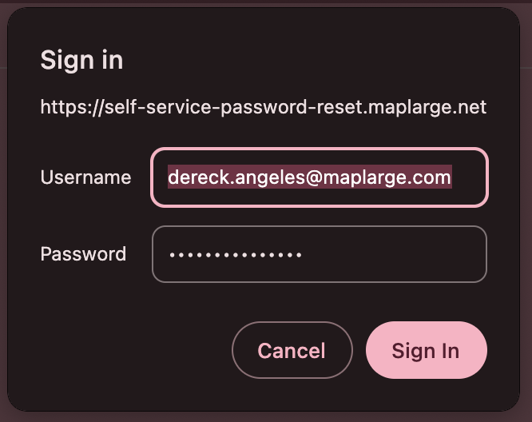
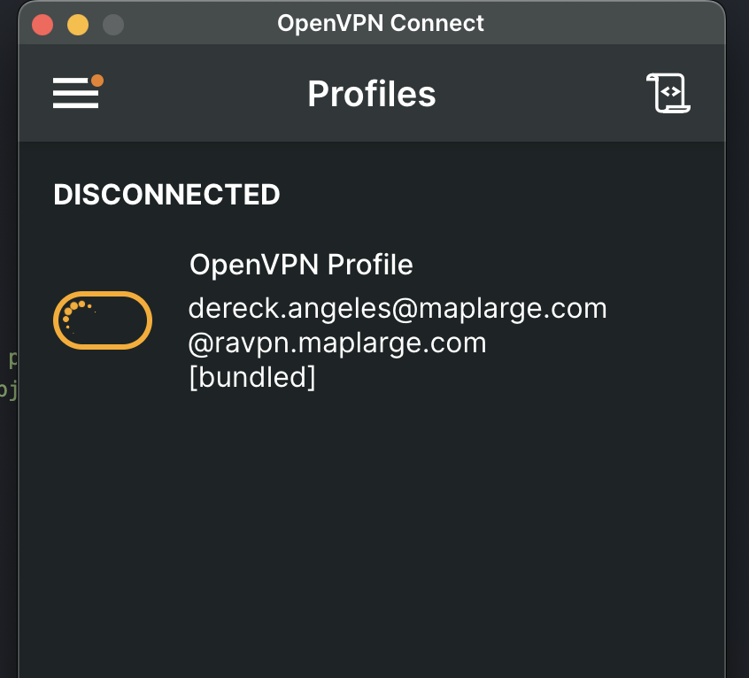

# MapLarge Onboarding Tutorial

## Objectives

- Identify your MapLarge user account and password.
- Learn how to download and set up the MapLarge software.
- Become familiar with the basic functions of the work environment.
- Complete a sample project to demonstrate proficiency in using MapLarge.

## 1. Identify your MapLarge user account and password.

- First of all, download and install `Google Chrome` on your computer.

  

- Then, install `Duo Mobile` on your cellphone.

  

- In a document that should have been sent to you by email, you will be able to find your email and temporary password.

- It should look something like this:
  - `dereck.angeles@maplarge.com`
  - `vaTynP=L3Soxwfpp`
- Change your password to one that is easy for you to remember and hard to guess.

- [Click here to change your password.](https://self-service-password-reset.maplarge.net/)

  

## 2. Login to MapLarge

- Enter Google Chrome and login with your account.

- Enroll in Duo Mobile. [Click Here](https://maplarge.login.duosecurity.com)

- Login to Amazon Web Services. [Click Here](https://maplarge-personnel.awsapps.com/start)

- Download Openvpn. [Click Here](https://ravpn.maplarge.com/)

  - Choose `SAML` option.
  - Choose your OS.

- After downloading and activating OpenVPN, turn on your VPN.



## 3. Install Dotnet

- Install Dotnet [SDK 6](https://dotnet.microsoft.com/en-us/download/dotnet/6.0)

## 4. Download MapLarge SDK

- Download MapLarge SDK. [Click Here](https://nuget.maplarge.net/packages/maplarge.cli)
  - OpenVPN must be running.

## 5. Setting Up Your Local ADK Project

#### Prerequisites

1. **Trust ASP.NET dev certs**: Run the following command:
    ```bash
    dotnet dev-certs https --trust
    ```

#### Installation

1. **Install the MapLarge CLI**: Run the following command:
    ```bash
    dotnet tool install --global MapLarge.CLI --add-source [path to nuget package folder] --version 1.0.41
    ```
    - (Maybe you need to add the nuget package folder to the nugets path.)

#### Project Setup

1. **Create a folder for your MapLarge work** on your computer.
2. **Open a PowerShell or Terminal window** and run:
    ```bash
    maplarge adk create-project -name mldocs
    ```
3. **Change directory** into the new `mldocs` folder.

#### Repository Cloning

1. Inside this folder, you should see a couple of folders: `.adk` and `extensions`.
2. **Clone the MLDocs-Extension repo**: Run the git command. Don't forget to include the "extensions" folder name at the end, so that it clones the repo inside that folder.
    ```bash
    git clone [clone URL from the Azure DevOps] extensions
    ```

#### Project Initialization

1. **Open VS Code** at the root of the ADK project folder (where the `tsconfig.json` file is). On Windows, you can just type `code .`.
2. Inside VS Code, open a Terminal and **initialize your project** by running:
    ```bash
    maplarge adk init -remoteServer https://contractor-screen.maplarge.net -profile cs
    ```

#### Running the Project

1. Now that you've initialized your project, you can **run it**:
    ```bash
    maplarge adk run
    ```
